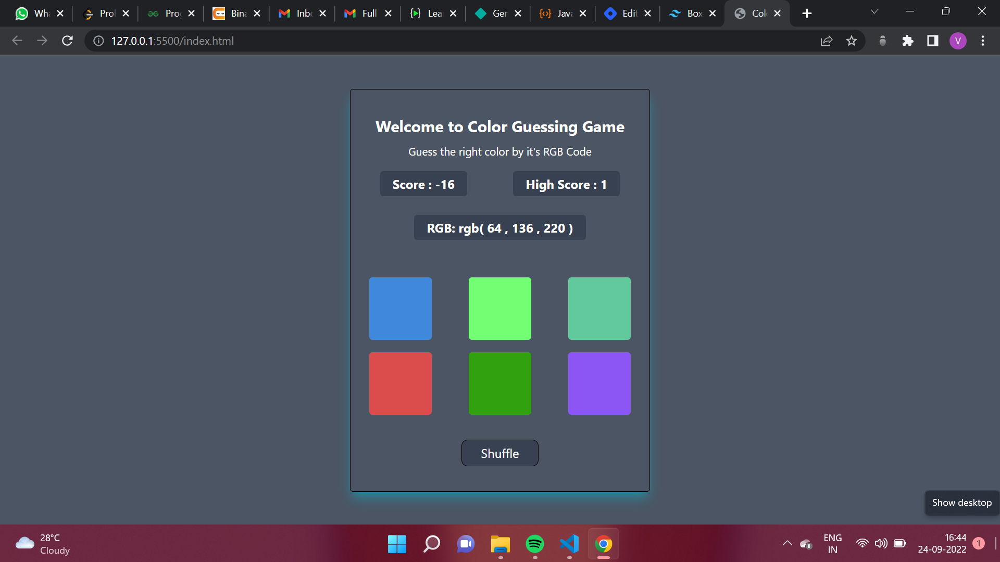

# **Color Guessing Game**
## **Overview**
This is a quite engaging game created using the JS in which the user has to guess the exact color by seeing it's RGB value. Every correct answer will increase the score and wrong answer will decrease the score also. If a user is finding hard to guess the color, he can change the color using the suffle button.

## **Technology Used**
1. HTML
2. Tailwind CSS
3. JavaScript

## **Output**

## **Live Link**
